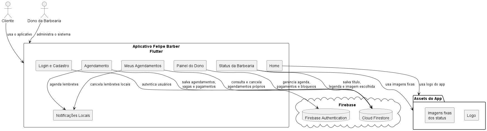
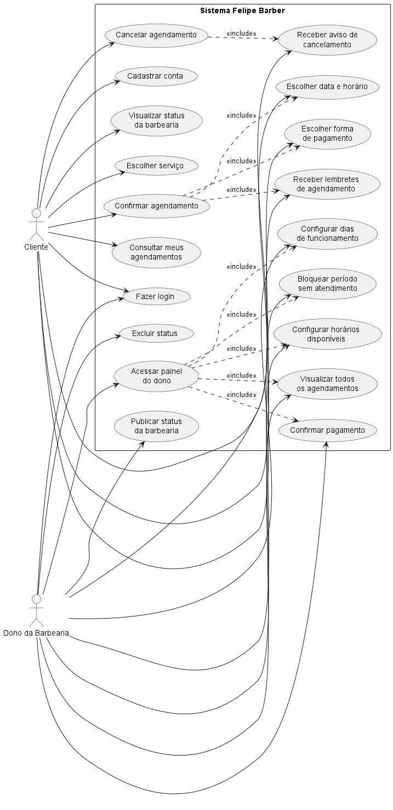
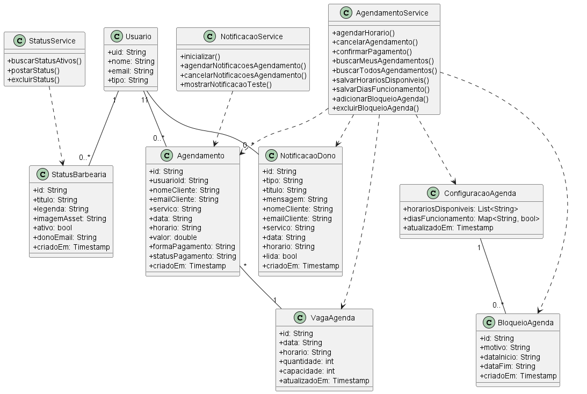
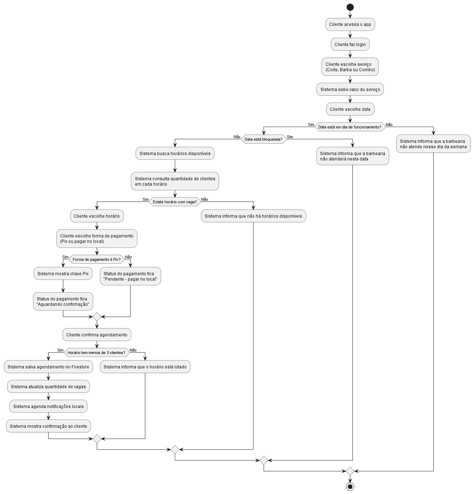
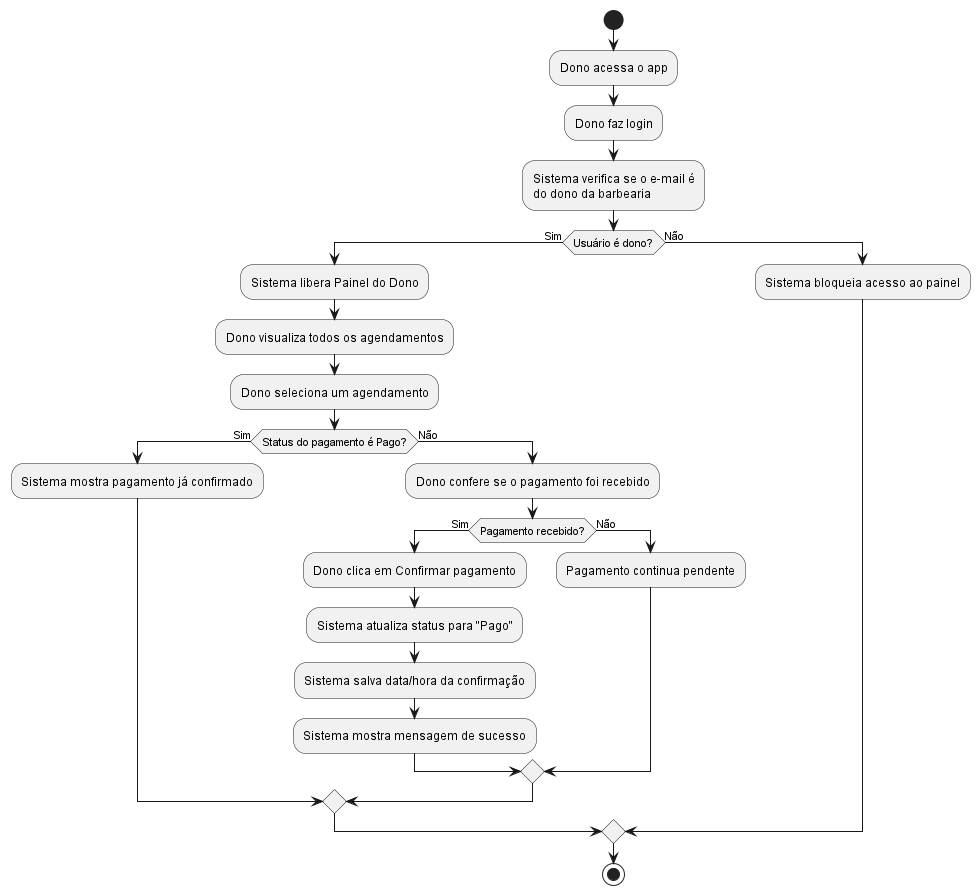
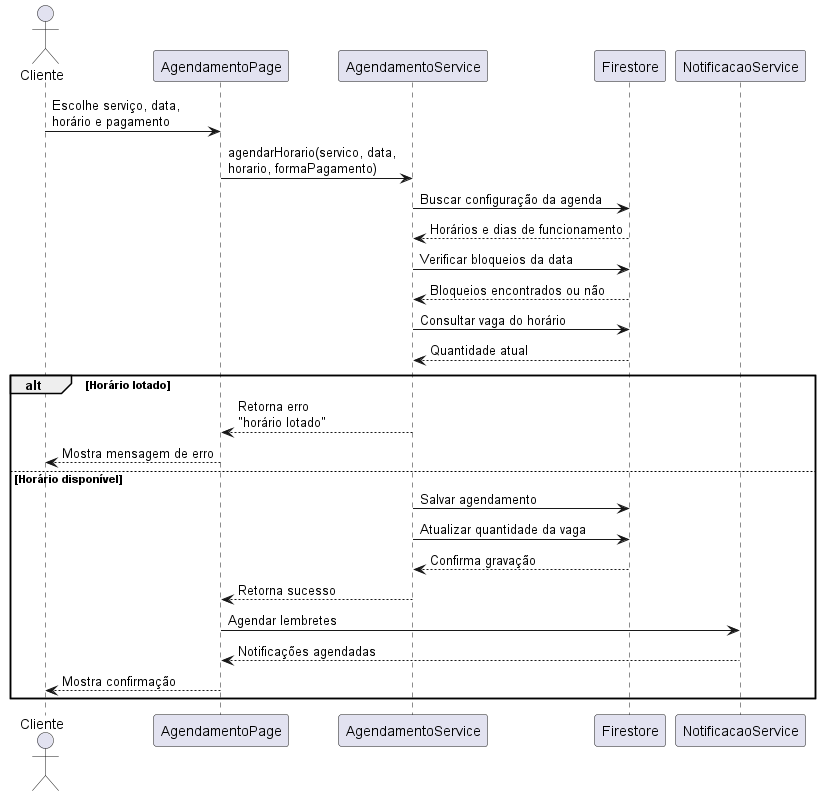
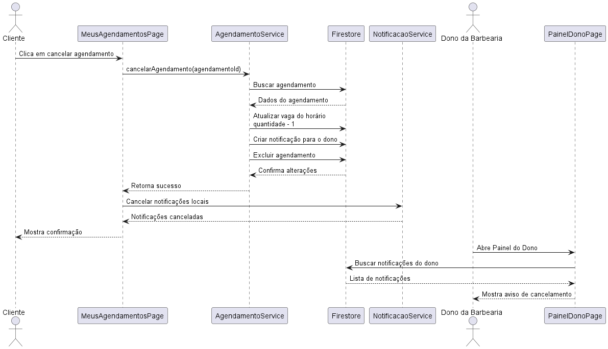
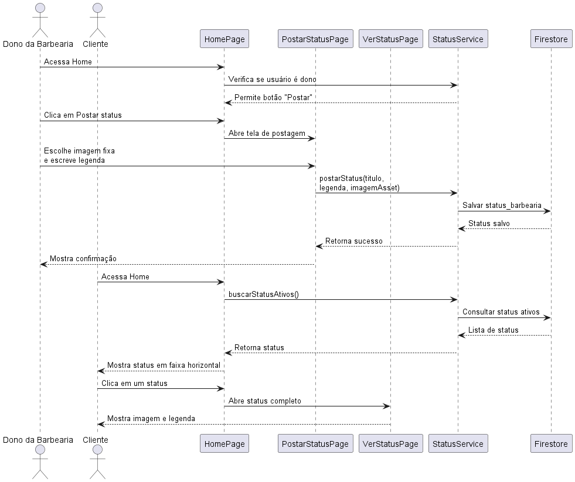

# Sistema Felipe Barber

## Engenharia de Software – Aplicativo de Agendamento para Barbearia

O **Felipe Barber** é um aplicativo mobile desenvolvido em **Flutter** com integração ao **Firebase**, criado para permitir que clientes realizem agendamentos de serviços de barbearia de forma simples e organizada.

O sistema possui funcionalidades para clientes e para o dono da barbearia. Os clientes podem criar conta, fazer login, escolher serviços, marcar horários, consultar seus agendamentos, cancelar horários e visualizar status publicados pela barbearia. O dono possui acesso a um painel administrativo, onde pode visualizar todos os agendamentos, confirmar pagamentos, configurar horários, bloquear dias de atendimento e publicar status.

---

## Tecnologias Utilizadas

- Flutter
- Dart
- Firebase Authentication
- Cloud Firestore
- Notificações locais
- PlantUML
- Git e GitHub

---

## Funcionalidades Principais

- Cadastro de usuários
- Login com Firebase Authentication
- Agendamento de serviços
- Controle de capacidade por horário
- Cada horário permite até 3 clientes, pois a barbearia possui 3 barbeiros
- Consulta de agendamentos do cliente
- Cancelamento de agendamentos
- Painel administrativo para o dono
- Configuração de horários disponíveis
- Configuração de dias de funcionamento
- Bloqueio de períodos sem atendimento, como viagem ou férias
- Registro de forma de pagamento
- Pagamento por Pix ou no local
- Confirmação manual de pagamento pelo dono
- Status da barbearia com imagens fixas e legendas
- Notificações locais de lembrete de agendamento
- Notificações internas para o dono quando um cliente cancela um agendamento

---

## Requisitos Funcionais

RF01 - O sistema deve permitir o cadastro de clientes.

RF02 - O sistema deve permitir o login de usuários.

RF03 - O sistema deve permitir que o cliente escolha um serviço da barbearia.

RF04 - O sistema deve permitir que o cliente escolha uma data e um horário disponível.

RF05 - O sistema deve permitir que o cliente realize um agendamento.

RF06 - O sistema deve permitir que o cliente consulte seus próprios agendamentos.

RF07 - O sistema deve permitir que o cliente cancele um agendamento.

RF08 - O sistema deve permitir que o cliente escolha a forma de pagamento.

RF09 - O sistema deve permitir pagamento por Pix ou pagamento no local.

RF10 - O sistema deve permitir que o dono visualize todos os agendamentos.

RF11 - O sistema deve permitir que o dono confirme pagamentos.

RF12 - O sistema deve permitir que o dono configure horários disponíveis.

RF13 - O sistema deve permitir que o dono configure os dias de funcionamento.

RF14 - O sistema deve permitir que o dono bloqueie períodos sem atendimento.

RF15 - O sistema deve permitir que o dono publique status da barbearia.

RF16 - O sistema deve permitir que os clientes visualizem os status publicados.

RF17 - O sistema deve enviar lembretes locais de agendamento ao cliente.

RF18 - O sistema deve registrar notificações internas para o dono quando um cliente cancelar um agendamento.

---

## Regras de Negócio

RN01 - Apenas usuários autenticados podem acessar as funcionalidades principais do sistema.

RN02 - Cada horário pode receber no máximo 3 clientes, pois existem 3 barbeiros disponíveis.

RN03 - O cliente só pode agendar horários configurados como disponíveis.

RN04 - O cliente não pode agendar em dias em que a barbearia não atende.

RN05 - O cliente não pode agendar em períodos bloqueados pelo dono.

RN06 - O pagamento pode ser feito por Pix ou no local.

RN07 - Pagamentos via Pix ficam com status "Aguardando confirmação" até que o dono confirme o recebimento.

RN08 - Pagamentos no local ficam pendentes até confirmação presencial.

RN09 - Apenas o dono da barbearia pode acessar o painel administrativo.

RN10 - Apenas o dono pode configurar horários, dias de funcionamento e períodos bloqueados.

RN11 - Apenas o dono pode publicar ou excluir status da barbearia.

RN12 - Quando um cliente cancela um agendamento, o dono recebe uma notificação interna no painel.

---

## Caso de Uso Principal Implementado

O caso de uso principal implementado foi:

**Realizar agendamento de serviço na barbearia.**

Esse caso de uso permite que o cliente escolha um serviço, visualize o valor, selecione uma data, escolha um horário com vaga disponível, selecione a forma de pagamento e confirme o agendamento.

O sistema valida se a barbearia atende no dia escolhido, se a data não está bloqueada, se o horário está disponível e se ainda existem vagas para aquele horário.

---

## Arquitetura do Projeto

A aplicação foi organizada em camadas simples, separando telas, serviços e integração com o Firebase.

A estrutura principal do projeto é:

```text
lib/
├── app/
│   ├── data/
│   ├── models/
│   ├── services/
│   │   ├── agendamento_service.dart
│   │   ├── notificacao_service.dart
│   │   └── status_service.dart
│   ├── viewmodels/
│   └── views/
│       ├── home_page.dart
│       ├── login_page.dart
│       ├── signup_page.dart
│       ├── agendamento_page.dart
│       ├── meus_agendamentos_page.dart
│       ├── painel_dono_page.dart
│       ├── postar_status_page.dart
│       └── ver_status_page.dart
```

As telas ficam na camada de **views**.

As regras de agendamento, pagamento, status e notificações ficam na camada de **services**.

O Firebase é utilizado como backend do sistema.

---

## Backend e Persistência

O projeto utiliza o Firebase como backend.

### Firebase Authentication

Utilizado para:

- cadastro de usuários;
- login;
- identificação do usuário logado;
- controle de acesso do dono da barbearia.

### Cloud Firestore

Utilizado para armazenar:

- agendamentos;
- vagas por horário;
- configurações da agenda;
- períodos bloqueados;
- status da barbearia;
- notificações internas do dono;
- informações de pagamento.

---

## Exemplos de Validações Implementadas

### Limite de clientes por horário

Cada horário aceita no máximo 3 clientes.

```dart
if (quantidadeAtual >= capacidadePorHorario) {
  throw Exception('Este horário já está lotado.');
}
```

### Verificação de acesso do dono

Apenas o e-mail definido como dono pode acessar o painel administrativo.

```dart
return usuario?.email?.toLowerCase() == emailDono.toLowerCase();
```

### Pagamento Pix aguardando confirmação

```dart
if (formaPagamento == 'Pix') {
  statusPagamento = 'Aguardando confirmação';
} else {
  statusPagamento = 'Pendente - pagar no local';
}
```

---

# Diagramas UML

## Diagrama Geral da Arquitetura

Este diagrama apresenta a visão geral do sistema. Ele mostra que o aplicativo foi desenvolvido em Flutter e se comunica com o Firebase Authentication para login e cadastro, com o Cloud Firestore para armazenar agendamentos, pagamentos, status e configurações, além de usar notificações locais no celular do cliente.



Arquivo PlantUML: [arquitetura_geral.puml](docs/diagramas/arquitetura_geral.puml)

---

## Diagrama de Casos de Uso

Este diagrama mostra as principais funcionalidades do sistema separadas entre Cliente e Dono da Barbearia. O cliente pode se cadastrar, fazer login, agendar serviços, consultar e cancelar agendamentos. O dono possui acesso ao painel administrativo, onde gerencia horários, pagamentos, status e bloqueios da agenda.



Arquivo PlantUML: [casos_uso.puml](docs/diagramas/casos_uso.puml)

---

## Diagrama de Classes do Domínio

Este diagrama representa as principais entidades do sistema, como Usuario, Agendamento, VagaAgenda, ConfiguracaoAgenda, BloqueioAgenda, StatusBarbearia e NotificacaoDono. Ele também mostra os serviços responsáveis por manipular essas informações no Firebase.



Arquivo PlantUML: [classes.puml](docs/diagramas/classes.puml)

---

## Diagrama de Atividade – Agendamento

Este diagrama mostra o passo a passo do agendamento. O cliente escolhe o serviço, a data, o horário e a forma de pagamento. O sistema valida se o dia está disponível, se não está bloqueado e se o horário ainda possui vagas.



Arquivo PlantUML: [atividade_agendamento.puml](docs/diagramas/atividade_agendamento.puml)

---

## Diagrama de Atividade – Pagamento

Este diagrama mostra como o dono confirma um pagamento. O cliente pode escolher Pix ou pagamento no local, mas a confirmação final é feita manualmente pelo dono no painel administrativo.



Arquivo PlantUML: [atividade_pagamento.puml](docs/diagramas/atividade_pagamento.puml)

---

## Diagrama de Sequência – Agendamento

Este diagrama mostra a comunicação entre a tela de agendamento, o serviço de agendamento, o Firestore e o serviço de notificações. Ele representa o fluxo técnico de salvar um agendamento e atualizar a quantidade de vagas.



Arquivo PlantUML: [sequencia_agendamento.puml](docs/diagramas/sequencia_agendamento.puml)

---

## Diagrama de Sequência – Cancelamento

Este diagrama mostra o fluxo de cancelamento feito pelo cliente. Quando o cliente cancela, o sistema remove o agendamento, atualiza a quantidade de vagas e cria uma notificação interna para o dono da barbearia.



Arquivo PlantUML: [sequencia_cancelamento.puml](docs/diagramas/sequencia_cancelamento.puml)

---

## Diagrama de Sequência – Status da Barbearia

Este diagrama mostra como o dono publica um status com imagem fixa e legenda. Os dados são salvos no Firestore e depois aparecem na Home dos clientes em formato parecido com stories.



Arquivo PlantUML: [status_barbearia.puml](docs/diagramas/status_barbearia.puml)

---

## Implementação

O sistema foi implementado em Flutter com integração ao Firebase.

A implementação contempla:

- autenticação de usuários;
- controle de agendamentos;
- validação de vagas disponíveis;
- limite de 3 clientes por horário;
- painel administrativo para o dono;
- controle de pagamento;
- status da barbearia;
- notificações locais;
- persistência dos dados no Cloud Firestore.

---

## Como Executar o Projeto

1. Clonar o repositório:

```bash
git clone https://github.com/hugofrancisco175/felipebarber.git
```

2. Entrar na pasta do projeto:

```bash
cd felipebarber
```

3. Instalar as dependências:

```bash
flutter pub get
```

4. Executar o projeto:

```bash
flutter run
```

---

## Observações

Este projeto foi desenvolvido para fins acadêmicos na disciplina de Engenharia de Software.

Como evolução futura, o sistema pode receber:

- integração com pagamento Pix automático;
- upload real de imagens usando Firebase Storage;
- consultor de corte com Inteligência Artificial usando Gemini API;
- escolha de barbeiro específico;
- notificações push com Firebase Cloud Messaging.